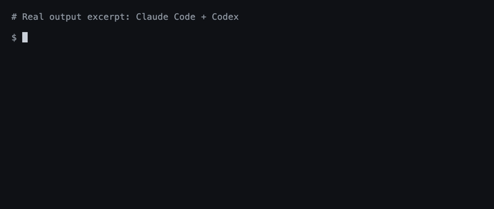

**Languages:** English | [简体中文](README.zh-CN.md)

# agentsync

**One command to share rules, skills, and MCP configs across your AI tools.**

Keep one copy across 20+ tools on your machine, including Claude Code, Codex, Cursor, Pi, and OpenCode. A lightweight standalone binary.

[](https://github.com/x0c/agentsync/actions/workflows/ci.yml) [](https://github.com/x0c/agentsync/releases/latest) [](LICENSE)



*A real Claude Code + Codex run; output excerpted for readability.*

## Install

**macOS — Homebrew:**

```sh
brew install --cask x0c/tap/agentsync
```

**macOS / Linux / Windows — Go 1.25+:**

```sh
go install github.com/x0c/agentsync@latest
```

Add Go's bin directory to PATH if needed (usually `~/go/bin`; `%USERPROFILE%\go\bin` on Windows).

**Without Go:** download and extract a [release binary](https://github.com/x0c/agentsync/releases/latest), then put it on PATH. Available for macOS and Linux (arm64 / amd64), and Windows (amd64). Checksums are included.

## Run

```sh
agentsync
```

That's it. Existing instructions are merged, complete skill folders are collected, and MCP servers are imported into one shared source. Installed tools receive links or configuration in their own format. Files replaced during sync are backed up automatically; tools you haven't installed are skipped.

From then on, maintain these files in `~/.config/agentsync/`:

| File | What you manage once |
|---|---|
| `AGENTS.md` | Global instructions |
| `skills/` | Complete skill folders, including scripts and references |
| `mcp.json` | MCP servers |

Run `agentsync` again after changes, or use the optional watcher below.

## Optional commands

| Need | Command |
|---|---|
| Preview without writing | `agentsync --check` |
| Automatically apply source changes | `agentsync --watch` |
| Restore the latest backup | `agentsync --rollback latest` |
| Link a project's `CLAUDE.md` to its `AGENTS.md` | `agentsync --repo` |

See the [workflow guide](docs/AGENTSYNC_GUIDE.md) for background services, batch repository sync, filters, and backup details.

## Good to know

- Default sync manages **global configuration on this machine**. Project files use the separate repository mode.
- Support varies by tool. See [instruction and skill support](docs/agent_runtime_global_paths.md) and [MCP support](docs/agent_runtime_mcp_paths.md).
- Instructions and skills use links where possible. Cursor gets a managed `.mdc` rule; Windows can fall back to managed copies. See [Cursor loading limits](docs/AGENTSYNC_GUIDE.md#cursor-rules-visible-in-settings-but-absent-from-the-prompt).
- Edit the shared source. The watcher applies changes outward; it does not import edits made in another tool's settings. Keep `mcp.json` local: it may contain tokens and machine-specific paths.

Questions or a missing tool? [Open an issue](https://github.com/x0c/agentsync/issues) with the tool name, OS, and redacted output. Contributor instructions: [AGENTS.md](AGENTS.md).

## License

[MIT](LICENSE)
