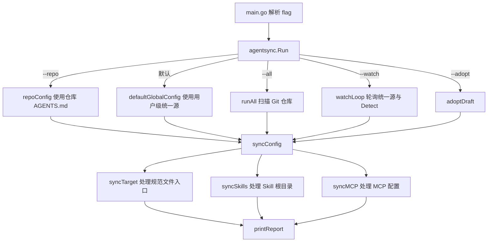

# agentsync 命令工作流 Guide

## 文档定位

本文覆盖 agentsync 的命令入口、用户工作流、验证方式和发布入口。它回答“执行哪个命令会发生什么、改完如何确认行为正确”。收敛机制内部细节、路径策略、备份策略和 Skill 根目录替换规则见 [AGENTSYNC_KNOWLEDGE_BASE.md](AGENTSYNC_KNOWLEDGE_BASE.md)。

## 核心命令速查

| 场景 | 命令 | 是否写文件 | 主要输出 | 实现入口 |
|---|---|---:|---|---|
| 预览全局收敛 | `agentsync --check` | 否 | `Results`、`Skills`、`MCP`、可能的 `Merge draft` | `main.go`；`internal/agentsync/run.go` |
| 执行全局收敛 | `agentsync` | 是 | 统一源、目标别名、备份、Skill 结果、MCP 结果 | `internal/agentsync/run.go`；`internal/agentsync/skills.go`；`internal/agentsync/mcp.go` |
| 后台持续收敛 | `agentsync --watch` | 是（有变化时） | 首次同步后，统一源或新装 runtime 变化再同步 | `internal/agentsync/watch.go` |
| 收敛当前仓库 | `agentsync --repo` | 是 | 当前仓库 `CLAUDE.md` 指向 `AGENTS.md` | `internal/agentsync/paths.go` |
| 批量收敛仓库 | `agentsync --all ~/Codes` | 是 | 扫描到的仓库数量与每个仓库结果 | `internal/agentsync/run.go` |
| 采纳合并草稿 | `agentsync --adopt <draft>` | 是 | 备份原统一源并用草稿替换 | `internal/agentsync/merge.go` |
| 强制替换冲突入口 | `agentsync --force` | 是 | 备份后替换错误链接或不同内容文件 | `internal/agentsync/run.go` |

## 命令调度流程



命令入口只负责参数到 `Options` 的映射。实际工作都汇入 `Run()`：先判断是否批量仓库模式，再根据全局/仓库模式生成配置，最后执行 `syncConfig()` 并打印报告。

## 全局收敛工作流

全局模式的统一源与目标来自 `defaultGlobalConfig()`：

| 类型 | 路径 | 说明 |
|---|---|---|
| 规范统一源 | `~/.config/agentsync/AGENTS.md` | 所有工具共享的指令文件 |
| Skill 统一源 | `~/.config/agentsync/skills` | 每个子目录是一个完整 skill |
| MCP 统一源 | `~/.config/agentsync/mcp.json` | 所有已安装工具共享的 MCP 服务器集合 |

规范/Skill 入口覆盖 Codex、OpenCode、Claude、Gemini、Qwen、Copilot、Kimi Code、Grok、Amp、Crush、Goose、Factory、iFlow、Kilo、Cursor、Windsurf、Zed、CodeBuddy、Qoder、Junie、Kiro、JoyCode 及通用 `~/.agents`，完整清单以 `defaultGlobalConfig()` 为准。各入口大致形如：

```text
规范入口：  ~/.codex/AGENTS.md、~/.claude/CLAUDE.md、~/.gemini/GEMINI.md、
            ~/.cursor/rules/AGENTS.mdc（cursor 模式受管副本）、~/.joycode/AGENTS.md …
Skill 入口：~/.codex/skills、~/.cursor/skills、~/.joycode/skills …
            （整体指向 Skill 统一源）
```

**按安装门控**：每个入口只在对应工具已安装（其用户级主目录如 `~/.codex`、`~/.joycode` 存在）时才收敛；未安装的工具报告为 `skipped`，不创建任何文件。因此在同一台机器上 `Results` / `Skills` / `MCP` 里出现的入口取决于你实际装了哪些工具。

第一次运行可能会出现 `created`、`merged`、`replaced`、`linked` 等状态，未装的工具显示 `skipped`。第二次运行已安装工具应收敛到 `ok`，这是幂等性判断的主要用户信号。

全局模式还会把 `mcp.json` 翻译写入已安装工具的用户级 MCP 配置，并在 `AGENTS.md` 注入「只改统一源」说明。仓库模式与 `--all` 不同步 MCP。落点与 schema 见 [agent_runtime_mcp_paths.md](agent_runtime_mcp_paths.md)。

## 检查模式

`--check` 只做状态判定，不创建统一源、不写备份、不替换入口、不复制 skill、不写 MCP 配置。报告中的状态含义：

| 状态 | 含义 | 下一步 |
|---|---|---|
| `skipped` | 该工具未安装（`Detect` 主目录不存在） | 无需处理；装了该工具再跑一次即可收敛 |
| `ok` | 入口已指向统一源 | 无需处理 |
| `missing` | 统一源或目标入口缺失 | 直接运行 `agentsync` 创建 |
| `mergeable` | 目标文件有独特内容，可合并进统一源 | 运行 `agentsync`，必要时检查合并结果 |
| `replaceable` | 文件或目录可被备份后替换 | 运行 `agentsync` |
| `wrong-link` | 已是链接但指向不对 | 运行 `agentsync`；冲突强时可加 `--force` |
| `broken-link` | 链接目标已失效 | 运行 `agentsync` 修复 |
| `blocked` | 目标不是可处理的普通文件或目录 | 人工判断后再处理 |

**AI 易错点**：不要把 `--check` 报告里的 “would ...” 当作已修复。它只说明下一次真实运行会做什么。

## 后台监听

MCP 配置不能整文件 symlink，Cursor 的 `AGENTS.mdc` 也是受管副本。`--watch` 用标准库轮询（默认 2 秒）统一源 `AGENTS.md` / `mcp.json` / `skills/`，以及各 runtime `Detect` 目录是否出现。指纹按这四块分开：只改规范或 Skill 时**不同步 MCP**，避免把工具 UI 里新加的服务器冲掉。`mcp.json` 变化或新装 runtime（Detect 出现）才会写 MCP。变化必须连续稳定一段时间才同步（trailing debounce，默认 1.5 秒）；新 Detect 目录再多等约 5 秒，给安装器写完首次配置。Skill 指纹忽略 Syncthing 冲突文件和 `.DS_Store`，但会跟踪 `.system` 隐藏 skill。它**不**监视 `~/.claude.json` 等热文件，避免写回环，也不从工具侧把 MCP 拉回统一源。用户应只改统一源。

空文件、`{}`、缺 `mcpServers` 的 `mcp.json` 会报错并跳过，不会清空已安装工具。watch 下即便写成 `"mcpServers": {}`，只要工具侧还有服务器也会拒绝覆盖；要清空请手动跑一次 `agentsync`。同步失败不会把这次坏指纹记成已处理，下次仍会重试。

不能与 `--check`、`--repo`、`--all`、`--adopt`、`--force` 同时使用。失败会打到 stderr 并继续监听，方便当 systemd/launchd 服务。

CLI 默认仍是一次性 `agentsync`。`--watch` 是可选常驻，不要改成隐式默认，也不要加 `agentsync service install`：只提供模板，由用户自己 enable。

Linux 用户单元模板：`contrib/systemd/agentsync.service`（`ExecStart` 默认 `%h/.local/bin/agentsync --watch`）。macOS 模板：`contrib/launchd/top.x0c.agentsync.plist`，需改成实际二进制路径。改 watch 代码后：`GOBIN=~/.local/bin go install .`，若本机已 enable 该单元则再 `systemctl --user restart agentsync.service`。

## 仓库模式

`agentsync --repo` 用当前 Git 仓库根目录的 `AGENTS.md` 作为项目级源，只管理一个目标：

```text
CLAUDE.md -> AGENTS.md
```

仓库模式通过 `findRepoRoot()` 找 `.git`，再由 `repoConfig()` 构造配置。目标使用相对链接模式，便于仓库移动目录后链接仍成立。

仓库模式不处理全局 Skill 目录、用户级全局规范入口，也不处理 MCP。

## 批量仓库模式

`agentsync --all <目录>` 会递归扫描目录下的 Git 仓库，并对每个仓库执行仓库模式。扫描时会跳过 `node_modules`、`.venv`、`target`、`build` 等常见大型构建目录。

批量模式的结果聚合到一个报告里，`Repositories` 表示扫描到的仓库数量。某个仓库出现错误会中断本轮执行；这适合个人工作区批量规范 `CLAUDE.md` 指针。

**AI 易错点**：`--all` 的语义是“批量仓库级指针收敛”，不是全局规范和 Skill 同步；不要把它写成对每个仓库执行全局模式。

## 合并草稿与采纳

当现有入口文件和统一源存在冲突时，agentsync 会尽量将独特内容追加到统一源。**例外**：带 `<!-- managed-by: agentsync` 的受管副本（含 Cursor `AGENTS.mdc`）是统一源衍生品，过期时直接以统一源覆盖，不会回写；否则改统一源后再同步会把旧副本整篇拼回源文件。

对于需要人工整理的场景，`createMergeDraft()` 会在合并草稿目录生成 Markdown，报告中出现 `Merge draft` 和下一步命令：

```bash
agentsync --adopt <draft-path>
```

采纳草稿时，`adoptDraft()` 会：

1. 展开草稿路径。
2. 确认草稿存在。
3. 非检查模式下备份当前统一源。
4. 将草稿内容写入统一源。
5. 继续执行一次同步，让目标入口重新收敛。

`--adopt --check` 只检查草稿路径是否可用，不替换统一源。

## Cursor 规则已同步但 Agent 看不到

`agentsync` / `agentsync --check` 对 Cursor 报告 `linked` / `ok`（目标 `~/.cursor/rules/AGENTS.mdc`）只说明**磁盘侧**已收敛。Settings → Rules 能列出该文件，也不等于当前 Agent 会话已把正文注入系统提示。

常见根因（Cursor 产品侧，非 agentsync 写错）：

1. **Agents Window / Agent 以 `$HOME` 为 workspace**——未打开具体项目文件夹时，`~/.cursor/rules/*.mdc` 经常不加载（论坛员工说明：打开项目 workspace 后才会同时吃到用户级 file-backed 规则与项目规则）。
2. **Settings 可见、运行时不注入**——file-backed 全局 `.mdc` 与 UI「User Rules」纯文本是两条链路；后者更稳。
3. **`alwaysApply: true` 偶发被当成可请求规则**——社区有报告（称客户端 3.2 修复）；表现是规则在「可 @」列表里，但不自动进提示词。
4. **Skills 仍可能正常**——`~/.cursor/skills` 与 rules 发现路径不同，可出现「skills 有、全局规则没有」。

自检：新开 Agent，直接问能否复述统一源里某段特有标题（如「收工前反思」）；能复述才算注入成功。勿只看 Settings 列表。

workaround（按稳妥程度）：

1. 用具体项目目录打开 workspace 再开 Agent（不要用 home）。
2. 把关键段落贴进 Settings → Rules → User Rules（纯文本，跨表面最稳）。
3. 聊天里 `@` 引用 `~/.cursor/rules/AGENTS.mdc`。

路径与置信度细节见 [agent_runtime_global_paths.md](agent_runtime_global_paths.md) Cursor 行与「主要冲突与存疑点」表。

## 本地开发验证

代码改动后至少执行：

```bash
go test ./...
go build ./...
```

修改 CLI 行为后执行：

```bash
GOBIN=~/.local/bin go install .
agentsync --check
```

本机若已 enable `agentsync.service`，install 后再 `systemctl --user restart agentsync.service`。回复里写出 `go test ./...` 的实际结果，不要只说测过了。

改发布配置后执行：

```bash
goreleaser check
```

文档-only 改动执行：

```bash
python3 /home/vibecoder/.config/agentsync/skills/doc-init/scripts/doc_nav_lint.py --root .
```

没有 HTTP 端口或本地数据库。可选的 `--watch` 用用户级 systemd/launchd 常驻，模板在 `contrib/`，不单独写 `OPERATIONS_GUIDE.md`。运行验证主要是 CLI 冒烟、测试，以及（若已 enable）确认 watch 服务用的是刚装的二进制。

## 发布入口

正式发布由 tag 触发：

```bash
git tag v0.1.0
git push origin v0.1.0
```

GitHub Actions 的 release 工作流使用 GoReleaser，读取 `.goreleaser.yml`，构建 Linux、Darwin、Windows 的 amd64/arm64 产物，并更新 `x0c/homebrew-tap` 的 cask。

发布前必须确认：

- `HOMEBREW_TAP_GITHUB_TOKEN` 已配置且有推送 `x0c/homebrew-tap` 的权限。
- `.goreleaser.yml` 的 `homebrew_casks` 仍指向正确 tap。
- tag 版本与 README 安装说明一致。

发布链路本次未深写为独立文档，已登记在根 `AGENTS.md` 的 doc-init backlog。

## 覆盖度与待补充项

- 代码推断覆盖：命令入口、参数分发、全局/仓库/批量/草稿工作流均已从代码和 README 校准。
- 多源证据补强：读取了 README、中文 README、CI、Release workflow、GoReleaser 配置和既有 docs。
- Git 弱信号：历史只有 5 个提交，热点主要集中在 README、docs、release workflow 和 Skill 同步，作为优先级参考，不单独沉淀成当前规则。
- Q&A 补充：缺少用户经验输入；真实团队常用命令、失败处理习惯和发布前人工检查口径仍待补充。
- 待补充：发布与安装链路、测试隔离与安全验证可在后续 doc-update/doc-init 续写中拆为独立 Guide。

<!-- 该文档由 doc-init 更新于 2026-06-30；定位：AI 修改 agentsync 命令工作流前的快速参考文档 -->

<!-- 该文档整理/压缩于 2026-09-05 -->
