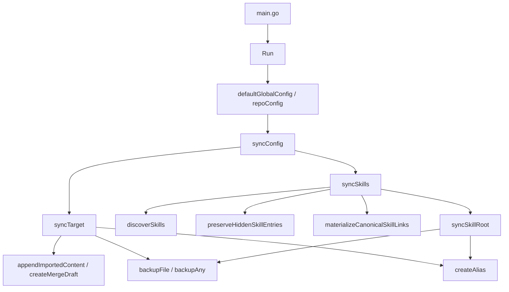
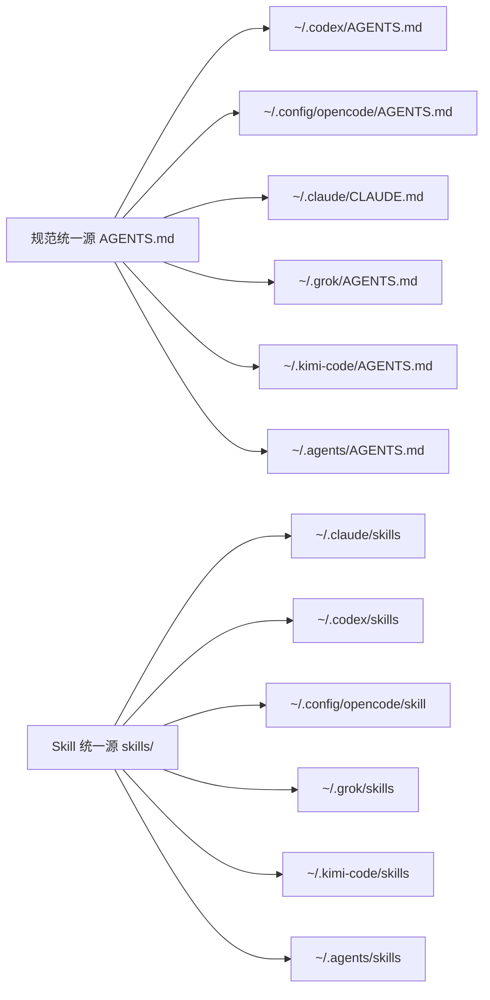

# agentsync 同步机制知识库

## §0 目录索引

| § | 标题 | 定位 |
|---|------|------|
| §1 | 机制背景与核心概念 | 首次接触同步机制时读 |
| §1.5 | 架构概览 | 快速建立调用链和对象关系 |
| §2 | 核心流程 | 理解规范文件与 Skill 如何收敛 |
| §2.5 | 物理路径速查 | 直接定位代码目录和文件 |
| §3 | 代码入口索引 | 按任务场景找入口 |
| §4 | 数据与持久化入口 | 理解文件系统状态和备份落点 |
| §5 | 任务与外部流程入口 | 理解 CLI、测试、CI、发布配置 |
| §6 | 核心规则与隐性约束 | 改代码前必扫的 AI 易错点 |
| §7 | 验证路径 | 改完后如何验证正确性 |
| §8 | 关联文档 | 跨文档联读指引 |
| §9 | 覆盖度与待补充项 | 了解文档置信度和缺口 |

## §1 机制背景与核心概念

agentsync 的同步机制围绕“统一源”和“工具入口”展开。统一源保存真实内容，工具入口只负责让各工具读到统一源。

核心概念：

- 规范统一源：`~/.config/agentsync/AGENTS.md`。
- Skill 统一源：`~/.config/agentsync/skills`。
- 规范目标入口：Codex、OpenCode、Claude Code、Grok、Kimi Code 的全局指令文件，以及通用跨工具入口 `~/.agents/AGENTS.md`。
- Skill 目标入口：各工具的用户 skill 根目录。
- 仓库级源：当前 Git 仓库的 `AGENTS.md`。
- 仓库级目标：当前 Git 仓库的 `CLAUDE.md`。
- 备份目录：`~/.config/agentsync/backups/`，由路径清洗后的目标路径和时间戳组成。

同步机制的安全原则是：先保留已有内容，再替换入口。文件内容通过合并或草稿处理，目录内容通过复制到统一源或备份后替换。

## §1.5 架构概览





## §2 核心流程

### 规范文件收敛

1. `syncConfig()` 检查统一源是否存在。
2. 统一源不存在时，收集可读目标入口内容，用 `createSourceFromFiles()` 创建统一源。
3. 对每个规范目标入口执行 `syncTarget()`。
4. 目标不存在时，创建指向统一源的别名。
5. 目标是正确链接时，报告 `ok`。
6. 目标是错误链接、断链、普通文件或可替换文件时，按检查模式/真实模式分支处理。
7. 真实模式下，替换前先备份；有独特内容时先追加到统一源或生成合并草稿。

`syncTarget()` 是规范文件收敛中最复杂的状态机，状态包括 `missing`、`ok`、`broken-link`、`wrong-link`、`blocked`、`replaceable`、`mergeable`、`linked`、`repaired`、`replaced`、`merged`。

### Skill 根目录收敛

1. `syncSkills()` 从每个工具侧 Skill 根目录发现合法 skill。
2. 统一 Skill 源不存在时创建目录，检查模式只报告。
3. `preserveHiddenSkillEntries()` 先复制隐藏目录，例如 Codex `.system`。
4. `materializeCanonicalSkillLinks()` 把统一源内部的 skill symlink 物化为真实目录。
5. 缺失的工具侧 skill 复制到统一源。
6. `syncSkillRoot()` 将每个工具侧 Skill 根目录整体替换为指向统一源的别名。

Skill 同步不在工具侧为每个 skill 单独建链接；目标是让整个工具侧 Skill 根目录指向同一个统一源。

### 仓库级收敛

仓库模式只处理当前仓库：

```text
CLAUDE.md -> AGENTS.md
```

`repoConfig()` 使用相对链接模式，这样仓库移动位置后 `CLAUDE.md` 仍能指向同仓的 `AGENTS.md`。仓库模式不处理用户级统一源，也不处理 Skill。

## §2.5 物理路径速查

| 目录或文件（相对项目根） | 内容 | 关键类/文件数 |
|---|---|---|
| `main.go` | CLI 参数解析与进程退出 | `main()` |
| `internal/agentsync/run.go` | 命令调度、规范目标同步、报告输出、批量仓库扫描 | `Run()`、`syncConfig()`、`syncTarget()`、`runAll()` |
| `internal/agentsync/skills.go` | Skill 发现、隐藏目录保留、根目录替换、统一源物化 | `syncSkills()`、`syncSkillRoot()` |
| `internal/agentsync/merge.go` | 合并草稿、采纳草稿、内容追加 | `createMergeDraft()`、`adoptDraft()` |
| `internal/agentsync/paths.go` | 默认路径、仓库路径、备份目录、路径展开 | `defaultGlobalConfig()`、`repoConfig()` |
| `internal/agentsync/files.go` | 创建别名、备份文件/目录、删除/复制/内容比较 | `createAlias()`、`backupFile()`、`backupAny()` |
| `internal/agentsync/types.go` | Options、Config、TargetResult、RunReport 数据结构 | `Options`、`RunReport` |
| `internal/agentsync/run_test.go` | 同步行为、幂等、Skill 目录、安全边界测试 | 多个 `Test*` |

## §3 本域代码入口索引

| 场景 | 入口 | 类/方法/配置 | 说明 |
|---|---|---|---|
| 新增或修改 CLI 参数 | CLI 入口 | `main.go` 的 `main()`；`internal/agentsync/types.go` 的 `Options` | 参数必须写入 `Options` 后由 `Run()` 统一分发 |
| 修改全局默认路径 | 路径配置 | `defaultGlobalConfig()` | 同步源、目标入口和 Skill 入口都在这里定义 |
| 修改仓库模式 | 仓库配置 | `repoConfig()`；`findRepoRoot()` | 只管理当前仓库 `CLAUDE.md` 到 `AGENTS.md` |
| 修改规范文件同步 | 规范同步 | `syncConfig()`；`syncTarget()` | 决定缺失、冲突、合并、替换和报告状态 |
| 修改 Skill 同步 | Skill 同步 | `syncSkills()`；`syncSkillRoot()` | 负责导入已有 skill 并替换工具侧 skill 根目录 |
| 修改合并策略 | 合并机制 | `appendImportedContent()`；`createMergeDraft()`；`adoptDraft()` | 影响已有内容如何进入统一源 |
| 修改别名降级策略 | 文件机制 | `createAlias()`；`writeManagedCopy()` | 影响 symlink、hardlink、受管副本选择 |
| 修改备份策略 | 文件机制 | `backupFile()`；`backupAny()`；`backupDir()` | 影响用户可恢复性 |
| 修改报告格式 | 输出机制 | `printReport()`；`TargetResult`；`RunReport` | README、测试和用户脚本可能依赖输出语义 |

## §4 数据与持久化入口

本项目没有数据库。持久化对象全部是文件系统状态：

| 对象 | 路径或来源 | 业务语义 | 改动注意 |
|---|---|---|---|
| 规范统一源 | `~/.config/agentsync/AGENTS.md` | 用户级指令唯一真实内容 | 不存在时可从已有工具入口导入 |
| Skill 统一源 | `~/.config/agentsync/skills` | 所有工具共享的 skill 根目录 | 子目录必须包含 `SKILL.md` 才算 skill |
| 工具规范入口 | Codex/OpenCode/Claude/Grok/Kimi Code 全局指令文件，及通用 `~/.agents/AGENTS.md` | 工具读取规范的入口 | 可为 symlink、hardlink 或受管副本 |
| 工具 Skill 入口 | 各工具 skill 根目录 | 工具发现 skill 的入口 | 新版策略是根目录整体别名 |
| 仓库级入口 | `AGENTS.md`、`CLAUDE.md` | 项目文档入口 | `CLAUDE.md` 应只指向 `AGENTS.md` |
| 备份 | `~/.config/agentsync/backups/` | 替换前恢复点 | 替换文件和目录前必须写备份 |
| 合并草稿 | `~/.config/agentsync/merge-drafts/` | 人工整理冲突内容 | 采纳后会替换统一源 |

## §5 任务与外部流程入口

| 类型 | 标识 | 代码/配置入口 | 适用场景 |
|---|---|---|---|
| CLI 冒烟 | `agentsync --check` | `Run()`；`printReport()` | 验证真实机器状态不被修改 |
| 单元测试 | `go test ./...` | `internal/agentsync/run_test.go` | 验证合并、链接、Skill 导入和幂等 |
| 构建 | `go build ./...` | `go.mod`；`main.go` | 验证 CLI 可编译 |
| 安装 | `go install .` | Go toolchain | 覆盖本机 agentsync |
| CI | GitHub Actions CI | `.github/workflows/ci.yml` | 多系统测试和构建 |
| 发布 | GoReleaser | `.github/workflows/release.yml`；`.goreleaser.yml` | tag 发布和 Homebrew cask 更新 |

## §6 核心规则与隐性约束

- **AI 易错点**【检查模式】`--check` 必须只读。新增分支时，所有写文件、建目录、备份、删除、复制、重命名动作都必须被 `opts.Check` 拦住，否则预览命令会真实改用户目录。
- **AI 易错点**【先导入再替换】替换现有规范文件或 Skill 目录前，必须先把可保留内容导入统一源或写入备份；不能为了“简化”直接删除目标入口。
- **AI 易错点**【Skill 根目录策略】工具侧 Skill 入口是整个根目录指向统一源，不是每个 skill 单独建链接。回退到逐个 skill 链接会重新引入删除/重命名不同步问题。
- **AI 易错点**【隐藏 Skill 目录】以点开头的隐藏 Skill 目录不参与普通 skill 发现，但要通过 `preserveHiddenSkillEntries()` 复制到统一源。忽略它会丢掉 Codex `.system` 这类工具内部 skill。
- **AI 易错点**【统一源内 symlink 物化】统一 Skill 源中普通 skill 如果是 symlink，需通过 `materializeCanonicalSkillLinks()` 变成真实目录，否则工具侧根目录统一后仍可能指向外部不稳定路径。
- 【仓库模式边界】`--repo` 和 `--all` 只处理仓库内 `CLAUDE.md -> AGENTS.md`；不要让它们改用户级 `~/.config/agentsync/AGENTS.md` 或 Skill 根目录。
- 【别名降级】`createAlias()` 的顺序是 symlink、Windows hardlink、受管副本。新增平台适配时不要跳过受管副本，否则低权限环境会失败。
- 【相对链接】仓库模式使用 `relative-link`；全局模式使用绝对路径。把仓库模式改成绝对链接会降低仓库移动后的可用性。
- 【冲突处理】普通文件内容不同时，默认合并独特内容；`--force` 才允许在备份后直接替换。不要把 `--force` 行为变成默认行为。
- 【报告语义】`TargetResult.Status` 是用户判断下一步的接口。新增状态时要同步 README、Guide 和测试，避免用户看到无法解释的输出。
- 【测试隔离】单测必须设置隔离配置根，不能依赖真实用户 home 下的 agentsync 状态。
- 【低置信度】真实用户最常见的冲突场景、手工整理草稿的团队习惯、发布前人工验收口径缺少用户经验输入；后续需要从实际使用反馈补充。

## §7 常见易忽略条件与验证路径

### 代码级验证

```bash
go test ./...
go build ./...
```

### CLI 冒烟验证

```bash
go install .
agentsync --check
```

检查点：

- `--check` 输出为 `agentsync check`。
- 不应新增备份文件。
- 已收敛入口应显示 `ok`。
- 未收敛入口应显示 `would ...` 类说明，而非真实写入结果。

### 仓库模式验证

```bash
agentsync --repo --check
```

检查点：

- Source 应为当前仓库的 `AGENTS.md`。
- Results 只包含当前仓库的 `CLAUDE.md`。
- 不应出现用户级 Skill 目录。

### Skill 根目录验证

```bash
agentsync --check
```

检查点：

- `Skills` 区块能报告 `~/.claude/skills`、`~/.codex/skills`、`~/.config/opencode/skill`、`~/.grok/skills`、`~/.kimi-code/skills`、`~/.agents/skills`。
- 已整体指向统一源时应显示 `ok` 或 skill directory symlink。
- 真实目录但可替换时应显示 `replaceable`，真实运行前会备份。

### 发布配置验证

```bash
goreleaser check
```

发布链路改动还需要在 GitHub Actions 中确认 release workflow 和 Homebrew tap 更新结果；这部分已登记为 backlog，当前文档只覆盖入口。

## §8 关联文档

- [AGENTSYNC_GUIDE.md](AGENTSYNC_GUIDE.md)：命令使用、验证和发布入口。
- [../README.md](../README.md)：公开英文用法。
- [../README.zh-CN.md](../README.zh-CN.md)：公开中文用法。
- [../AGENTS.md](../AGENTS.md)：项目文档导航、领域地图和 backlog。

## §9 覆盖度与待补充项

- 代码推断覆盖：已覆盖 `Run()`、`syncConfig()`、`syncTarget()`、`syncSkills()`、`syncSkillRoot()`、路径配置、备份、别名和合并草稿。
- depth_scanner 信号：机械信号 1 条，为测试中的幂等性提示；已写入 `--check`、重复运行应收敛为 `ok` 和测试隔离规则。其余状态机、并发、事件、数据库、JSON 字段信号均无。
- 领域语言统一：正文统一使用“规范统一源”“Skill 统一源”“工具入口”“仓库模式”；代码名保留为实现入口。
- 多源证据补强：已读取 README、中文 README、既有 docs、CI、Release workflow、GoReleaser 配置、图谱架构摘要。
- Git 弱信号：可用但样本很少，只有 5 个提交；Skill 同步和 release workflow 是热点候选，不作为独立业务规则来源。
- 数据库证据：本仓无数据库配置，未执行数据库 catalog。
- Q&A 补充：缺少用户经验输入；§6 的低置信度条目需要后续真实使用经验补齐。
- 待补充：发布与安装链路、测试隔离与安全验证已登记到根 `AGENTS.md` backlog。

<!-- 该文档由 doc-init 更新于 2026-06-30；定位：AI 修改 agentsync 同步机制前的快速参考文档 -->
