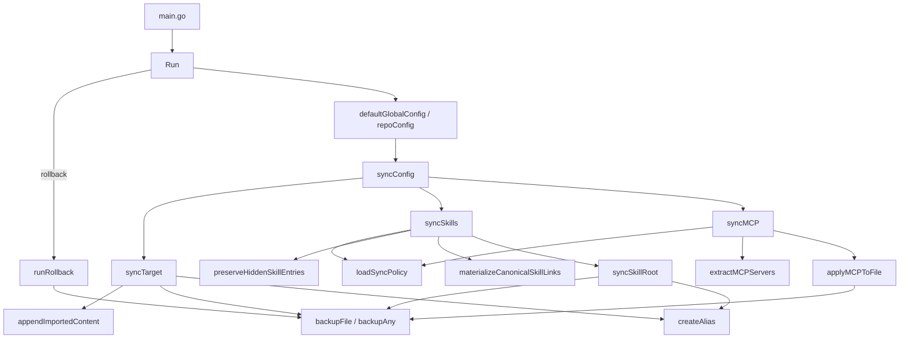

# Synchronization knowledge base

This document owns synchronization mechanisms and preservation boundaries. [Repository instructions](../AGENTS.md) own contribution rules; the [workflow guide](AGENTSYNC_GUIDE.md) owns commands, report states, validation, and releases.

## Ownership and architecture

Canonical instructions (`AGENTS.md`), complete skill directories (`skills/`), MCP definitions (`mcp.json`), and optional policy (`sync-policy.json`) live under `~/.config/agentsync/`. Runtime entries expose that content in each tool's format. Canonical content remains complete; policy changes only the view written to a runtime.

`Detect` is each runtime's installation directory. A nonempty, absent `Detect` path must return `skipped` before any write. Use the runtime home rather than its skill subdirectory: an installed runtime may not have created its skill directory yet. In particular, do not create JoyCode's home merely to write MCP configuration, because doing so can interfere with the runtime's legacy migration.

```mermaid
flowchart TD
    CLI[main.go] --> Run[Run]
    Run -->|rollback| Restore[runRollback]
    Run --> Config[defaultGlobalConfig / repoConfig]
    Config --> Sync[syncConfig]
    Sync --> Instructions[syncTarget]
    Sync --> Skills[syncSkills]
    Sync --> MCP[syncMCP]
    Skills --> Policy[loadSyncPolicy]
    MCP --> Policy
    Instructions --> Merge[appendImportedContent]
    Instructions --> Backup[backupFile / backupAny]
    Instructions --> Alias[createAlias]
    Skills --> Preserve[preserveHiddenSkillEntries]
    Skills --> Materialize[materializeCanonicalSkillLinks]
    Skills --> Root[syncSkillRoot]
    Root --> Backup
    Root --> Alias
    MCP --> Extract[extractMCPServers]
    MCP --> Apply[applyMCPToFile]
    Apply --> Backup
    Restore --> Backup
```

## Instructions and aliases

When the canonical source is missing, readable runtime entries can initialize it. Each installed target then follows the `syncTarget()` state machine: absent targets are created, correct links report `ok`, and broken/wrong links or differing files are repaired according to check/apply mode.

Preserve unique user-written content before replacement by importing it; back up replaced entries. Reviewed replacement content can be prepared manually and adopted with `--adopt`; the current synchronization path does not generate merge drafts automatically. Ordinary differing files merge by default. `--force` permits direct replacement after backup and must not become the default.

Files marked `<!-- managed-by: agentsync` are generated copies, including Cursor `.mdc` rules. If stale, replace them from the canonical source; never import their old body back into it. `sameContent()` strips managed markers and Cursor frontmatter. An equivalent ordinary file reports `ok` unless forced.

Alias fallback order is symlink, Windows hardlink, then managed copy. Global links use absolute resolved paths. Repository mode uses a relative `CLAUDE.md -> AGENTS.md` link so moving a checkout remains safe. Cursor is an explicit exception to bare aliases: its managed `.mdc` requires `alwaysApply` frontmatter.

Repository and batch modes manage only repository instruction entries. They must not modify global instructions, skills, or MCP configuration.

## Skills

`syncSkills()` discovers directories containing `SKILL.md`, preserves hidden runtime content such as `.system`, materializes ordinary skill symlinks in the canonical source into real directories, and imports missing skills before replacing runtime roots.

Without effective policy filtering, a runtime skill root aliases the entire canonical root. This makes additions, deletions, and renames visible immediately. With filtering, it becomes a real directory containing symlinks only for allowed skills, plus preserved hidden directories. Removing filtering restores the whole-root alias after backup. Always creating individual skill links would reintroduce stale deletions and renames.

Hidden directories are excluded from ordinary skill discovery but retained by `preserveHiddenSkillEntries()`. They also participate in watch fingerprints. Never treat all dot-directories as disposable.

### Known filtering limitations

- Codex can discover skills through both its own skill root and `~/.agents/skills`. Filtering only the Codex target does not hide a skill available through the shared root. To disable it in Codex, also set `[[skills.config]]` with `name = "<skill>"` and `enabled = false` in Codex configuration. Name-based disabling was verified with Codex 0.159; verify the installed version before changing this workaround.
- `materializeFilteredSkillRoot()` copies hidden directories only when absent. Existing filtered-root `.system` content is a snapshot, not a continuously refreshed canonical view. Updating canonical hidden content currently requires synchronizing that copy separately; preserve any runtime-owned changes when doing so.

Follow-up: support Codex name-based disable entries through a safe key merge, and reconcile hidden-copy updates without discarding runtime changes. These are recorded limitations, not implemented features.

## MCP

Global synchronization injects the English canonical-source notice into `AGENTS.md` before exposing it to runtimes. If `mcp.json` is absent, installed runtime configurations initialize it through a case-insensitive server-name union; the first encountered definition wins. Policy does not affect this import.

For each installed target, apply name-based policy, exclude runtime-specific bundled servers where necessary, translate its dialect, and compare the resulting server set semantically. An equivalent set reports `ok` without rewriting a hot configuration file. Filtered names can appear in the detail.

Dedicated MCP files can be replaced. Mixed files must preserve unrelated authentication, trust, settings, and state by changing only the MCP key. Use atomic writes in the same directory and account for concurrent runtime writes. Never apply whole-file instruction symlinks to mixed MCP configuration.

New canonical MCP files use `0600`. Preserve existing target permissions. Configuration may contain plaintext tokens and private URLs: keep canonical MCP, backups, and merge drafts out of Git and Syncthing. When the canonical root has `.git` or `.stfolder`, `ensureSecretIgnores()` adds `mcp.json`, `backups/`, and `merge-drafts/` to the corresponding ignore file. Policy contains no tokens and can be synchronized separately.

Empty files, malformed JSON, or a missing `mcpServers` object fail without overwriting targets. Watch also rejects an empty map if installed runtimes still have servers; intentional clearing requires a one-shot apply.

Codex bundled local servers identified by `SkyComputerUseClient`, `node_repl`, or `NODE_REPL_*` remain in the canonical source for Codex round trips, but are not copied to other runtimes. Crush command substitution must be rejected, not passed through. iFlow and the shared `~/.agents` entry have no MCP output.

The [MCP path/format guide](agent_runtime_mcp_paths.md) owns dialect rules and runtime-specific detection. Pi retains policy key `pi`; `piMCP` selects `auto`, `native`, or `adapter`. Native writes preserve top-level settings and per-server `exposure`, `toolExposure`, `oauth`, `timeout`, and `enabled`; removed servers still disappear. Adapter-owned files are not renamed or rewritten as native configuration.

## Policy

`sync-policy.json` is separate from MCP secrets. Match runtime and server/skill names case-insensitively. Deny wins; a nonempty target allowlist applies next; otherwise use the section default (`allow` when omitted). Unknown runtime names warn rather than fail. Denied servers disappear from the written set rather than being emitted as disabled entries.

A missing policy preserves the unfiltered behavior. The canonical source always remains complete. Changes to policy semantics require aligned documentation and tests.

## Watch

The watcher tracks canonical sources, policy, runtime presence, and Pi selection. Do not monitor runtime output files such as `~/.claude.json`: that creates write loops. Runtime-side MCP edits are not automatically imported.

Instruction/skill-only changes with an unchanged policy set internal `Options.SkipMCP`. Policy changes must update both skills and MCP. `SkipMCP` is not a public CLI flag.

Only a successful `runOnce()` advances the successful fingerprint. Failed writes and invalid source content must be retried. Ignore Syncthing conflict files, `.DS_Store`, and `.stversions`, but include `.system`; exclude directory mtimes so ignored files cannot trigger updates. Watch remains opt-in, incompatible with forced replacement, and configured through the service templates rather than a service-install subcommand.

## Backups and rollback

File copies and instruction imports must close each opened file exactly once and propagate close failures along with any earlier write/copy error. Otherwise a failed final write can be reported as successful preservation. Watch fingerprint writes must also propagate errors instead of silently advancing. The Go contracts for [File.Close](https://pkg.go.dev/os#File.Close) and [errors.Join](https://pkg.go.dev/errors#Join) support single-close handling while retaining multiple errors.

A real synchronization uses `beginBackupSession()` / `endBackupSession()`. Replaced paths share one unique timestamp directory containing payloads and `manifest.json`, with original absolute paths and file/symlink/directory types. Same-second sessions receive suffixes such as `-01`; reusing a stamp could overwrite the payload currently being restored.

Rollback supports read-only preview, backs up current entries before restoring, and does not call synchronization afterward. Old stamps without a manifest require manual restoration. Backups cover replaced entries in that session, not the entire machine.

## Implementation anchors

| File | Responsibility |
|---|---|
| `main.go`, `types.go` | Flags, options, configuration, and report types |
| `run.go` | Dispatch, instruction state machine, batch scanning, reports |
| `paths.go` | Canonical sources, runtime targets, repository configuration, path expansion |
| `files.go` | Aliases, managed copies, payload comparison, file/directory preservation |
| `merge.go` | Source initialization, unique-content imports, reviewed-file adoption |
| `skills.go`, `policy.go` | Skill discovery/import, hidden content, filtered views, policy evaluation |
| `mcp.go`, `mcp_extract.go`, `mcp_server.go`, `mcp_json.go` | Source import, semantic comparison, MCP normalization, secret ignores |
| `mcp_render.go`, `mcp_apply.go` | Dialect rendering and configuration-key updates |
| `mcp_dsh.go`, `pi_mcp.go` | dsh managed patches and Pi output selection |
| `watch.go` | Polling, fingerprints, debounce, retries |
| `backup_session.go`, `restore.go` | Session manifests and rollback |

Paths other than `main.go` are under `internal/agentsync/`. Matching `_test.go` files exercise preservation, isolation, rollback, policy, idempotency, and dialect edge cases. Use the code graph for call relationships rather than duplicating a complete symbol inventory here.

## Verification boundaries

The [workflow guide](AGENTSYNC_GUIDE.md#development-validation) owns local commands and real-path smoke expectations. MCP tests additionally cover absent runtimes, malformed/empty sources preserving outputs, policy filtering, mixed-file state preservation, and watch's empty-map protection. Skill tests must cover hidden content and transitions between filtered and whole-root views.

A synchronized file proves filesystem behavior, not runtime prompt loading, approval, OAuth, or remote connectivity. Cursor injection and native Pi sign-in require their own runtime acceptance. Historical upstream observations in the path guides are version-specific; consult current official documentation before changing implementation contracts.
