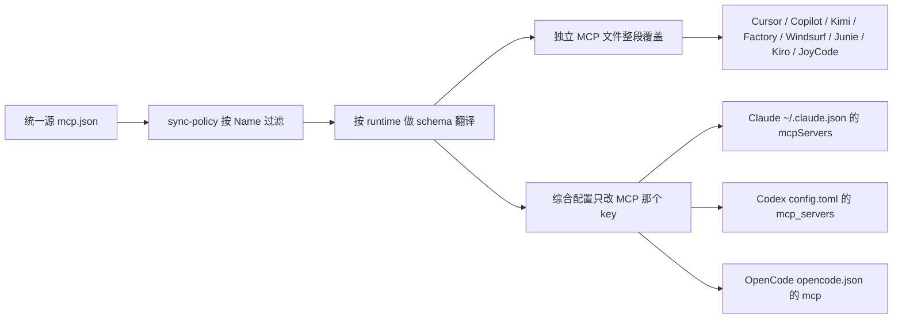

# 市面主流 Agent Runtime 用户级 MCP 配置落点与 schema

> 调研日期：2026-08-15 · 官方文档 / 本机 CLI / 安装包或浅克隆源码交叉核实
> **代码已实现**（2026-08-15）。实现或调整 MCP 同步时以本文为准；规范文件与 Skill 路径仍看 [agent_runtime_global_paths.md](agent_runtime_global_paths.md)。
> 符号约定：`~` = 用户主目录（macOS/Linux `$HOME`；Windows `%USERPROFILE%`）；Detect 语义与现有规范/Skill 入口相同——标志目录不存在则 `skipped`，绝不创建。

agentsync 要解决的是各工具 MCP 配置漂移：同一套服务器在不同客户端里重复手写、字段名和开关极性还不一致。本机已出现实锤（例如 `codebase-memory-mcp` 在 Codex/Claude/OpenCode 有、Cursor 没有）。

实现入口：`internal/agentsync/mcp.go`（`syncMCP()`），路径表在 `defaultGlobalConfig()` 的 `MCPTargets`。

## 一、已拍板的实现约束

- **统一源即唯一真相**：目标里的 MCP 服务器集合以统一源为准覆盖；实现时往全局 `AGENTS.md` 注入一段幂等托管说明，让 Agent 只改统一源、不要改各工具自己的配置。
- **统一源路径**：`~/.config/agentsync/mcp.json`（与 `AGENTS.md`、`skills/` 平级）。
- **按工具裁剪**：可选 `~/.config/agentsync/sync-policy.json`（与 `mcp.json` 平级，**不含 token**，可跨机同步）。统一源仍是全集；过滤只发生在写出到某个 runtime 时。缺省文件 = 行为与过去完全一致。求值：**deny 优先** → 若该 target 写了非空 `allow` 则白名单 → 否则用 `mcp.default`（缺省 `allow`）。目标键用 `MCPTarget.Name`（`codex`、`claude`、`cursor`…）。名称匹配大小写不敏感；未知 target 名只警告不失败。不做 tool 名级过滤，也不写各工具的 disabled/企业 allowlist。实现：`internal/agentsync/policy.go`，在 `filterServersForDialect` 之前按 Name 过滤。
- **统一源 schema**（Claude/Cursor 常见形态）：

```json
{
  "mcpServers": {
    "<name>": {
      "type": "stdio",
      "command": "npx",
      "args": ["-y", "some-mcp"],
      "env": {}
    },
    "<remote>": {
      "type": "http",
      "url": "https://example/mcp",
      "headers": {}
    }
  }
}
```

- **不能整文件 symlink 混杂配置**（Codex `config.toml`、Claude `~/.claude.json`、OpenCode `opencode.json`、Zed `settings.json` 等）。独立 MCP 文件可以整段替换 `mcpServers`。
- **允许引入解析库**（TOML / YAML / JSONC）。这是对本仓「仅标准库」约束的例外，实现时同步改根 `AGENTS.md` 技术栈说明。
- **允许明文密钥**，新建统一源用 `0600`，不要改已有目标文件权限。统一源常含 token / `private_` URL：**不得提交进本仓或用户配置仓，也不要默认同步到其他机器**；用户 `~/.config/agentsync/` 若是 git / Syncthing 目录，必须把 `mcp.json`、`backups/`、`merge-drafts/` 写入 `.gitignore` / `.stignore`。
- **超时字段跨 runtime 默认丢弃**，不做隐式毫秒/秒换算。
- **不代做本机批准名单**（Cursor `agent mcp enable`、项目级信任对话框、企业 allowlist）。
- **并集导入大小写不敏感**：`Mobbin` 与 `mobbin` 视为同一服务器，先到先得保留先看到的名字。
- **Codex 捆绑本机服务器不扩散**：`node_repl` / `computer-use`（`SkyComputerUseClient`、`NODE_REPL_*`）只写回 Codex；其他工具不写这些条目，避免启动失败。统一源仍保留它们，以便 Codex 往返。
- **心流 iFlow 的 MCP 首发不做**（已于 2026-04-17 关停并引导 Qoder）。规范/Skill 入口若目录仍在，维持现有 Detect 跳过即可。
- **`~/.agents` 无 MCP 入口**，不要为它造入口（pi-mcp-adapter 也读 `~/.agents/mcp.json`，但那会让所有装了 adapter 的工具共享同一文件，跨机行为不可控；Pi 的 MCP 落点用 `~/.config/mcp/mcp.json`）。



策略文件示例（Codex 不要 tavily；Claude 只保留白名单）：

```json
{
  "version": 1,
  "mcp": {
    "default": "allow",
    "targets": {
      "codex": { "deny": ["tavily"] },
      "claude": { "allow": ["codebase-memory-mcp", "context7"] }
    }
  },
  "skills": {
    "default": "allow",
    "targets": {
      "codex": { "deny": ["lark-im"] }
    }
  }
}
```

`skills` 段与 MCP 同规则；有有效过滤时该工具的 skill 根改为真实目录 + 指向统一源的子软链，无过滤时仍整目录软链到统一源。
## 二、写入策略总表（按 Detect 门控）

「模式」：`file` = 独立 MCP 文件，可用整段覆盖；`key` = 综合配置里只改指定 key，必须保留其余内容。

| 工具 | Detect | 写入目标 | 模式 | 容器 / 形态 | 首发 |
|---|---|---|---|---|---|
| Codex CLI | `~/.codex` | `~/.codex/config.toml` | key | TOML `[mcp_servers.<name>]` | 做 |
| Claude Code | `~/.claude` | `~/.claude.json` 顶层 `mcpServers`；若设了 `CLAUDE_CONFIG_DIR` 则 `$CLAUDE_CONFIG_DIR/.claude.json` | key | JSON `mcpServers` | 做 |
| OpenCode 1.18.x | `~/.config/opencode` | 已有 `opencode.json` 则只改它；否则仅有 jsonc 则改 jsonc；都没有则新建 `opencode.json` | key | 扁平 `mcp.<name>`，`type: local\|remote` | 做 |
| Gemini CLI | `~/.gemini` | `~/.gemini/settings.json` | key | `mcpServers`；HTTP 用 `httpUrl`，SSE 用 `url` | 做 |
| Qwen Code | `~/.qwen` | `~/.qwen/settings.json` | key | 与 Gemini 同源 | 做 |
| Copilot CLI | `~/.copilot` | `~/.copilot/mcp-config.json` | file | `mcpServers` | 做 |
| Kimi Code | `~/.kimi-code` | `$KIMI_CODE_HOME/mcp.json`，默认 `~/.kimi-code/mcp.json` | file | `mcpServers`；不写 `config.toml`，不读 `~/.kimi/mcp.json` | 做 |
| Grok CLI | `~/.grok` | `~/.grok/user-settings.json` | key | `mcp.servers` **数组**（`id`/`label`/`enabled`/`transport`） | 做 |
| Amp | `~/.config/amp` | `~/.config/amp/settings.json` | key | 扁平点号键 `"amp.mcpServers"`，不要写成嵌套 `"amp":{"mcpServers"}` | 做 |
| Crush | `~/.config/crush` | `~/.config/crush/crush.json` | key | 顶层 `mcp`；开关是 `disabled`；须清洗 `$(...)` | 做 |
| Goose | `~/.config/goose` | `~/.config/goose/config.yaml` | key | `extensions` **map**（不是 list） | 做 |
| Factory Droid | `~/.factory` | `~/.factory/mcp.json` | file | `mcpServers` | 做 |
| iFlow | `~/.iflow` | — | — | 停服，MCP 首发跳过 | **跳过** |
| Kilo | `~/.config/kilo` | `~/.config/kilo/kilo.jsonc`（或已有的 `kilo.json`） | key | OpenCode **v1**：顶层 `mcp`，`local\|remote`，command 为 argv 数组 | 做 |
| Cursor | `~/.cursor` | `~/.cursor/mcp.json` | file | `mcpServers`；`type` 写 `http` 不要写 `streamable-http` | 做 |
| Windsurf | `~/.codeium/windsurf` | `~/.codeium/windsurf/mcp_config.json` | file | `mcpServers`；remote 首选 `serverUrl`（`url` 现已接受） | 做 |
| Zed | `~/.config/zed` | `~/.config/zed/settings.json` | key | `context_servers`；扁平 `command` 字符串；**不要** `source: custom`、**不要**嵌套 `{path,args}` | 做 |
| CodeBuddy | `~/.codebuddy` | 按已存在文件探测，见 §3 | file 或 key | `mcpServers` | 做 |
| Qoder | `~/.qoder` | `~/.qoder/settings.json` 的 `mcpServers` | key | **不存在** `~/.qoder/mcp.json` | 做 |
| Junie | `~/.junie` | `~/.junie/mcp/mcp.json` | file | `mcpServers`；不要写旧路径 `~/.junie/mcp.json` | 做 |
| Kiro | `~/.kiro` | `~/.kiro/settings/mcp.json` | file | `mcpServers` | 做 |
| JoyCode | `~/.joycode` | `~/.joycode/joycode-mcp.json` | file | `mcpServers`；**禁止为 MCP 创建** `~/.joycode`（会挡住旧目录迁移） | 做 |
| Pi | `~/.pi/agent` | `~/.config/mcp/mcp.json` | file | `mcpServers`（标准共享全局配置，见下方 Pi 小节） | 做 |
| Pi | `~/.pi/agent` | `~/.config/mcp/mcp.json` | file | `mcpServers`（pi-mcp-adapter 扩展读共享全局配置，优先级最高） | 做 |
| dsh | `~/.dsh`（`$DSH_HOME` 可改根） | `$DSH_HOME/cordis.patch.yml`（host 层，全 profile 生效） | patch | `- insert:` 下每 server 一个 `@deepseek-ai/dsh-mcp-client` 条目；agentsync 只写 marker 包裹的 managed 块 | 做 |

Windows 差异（与 Detect 目录相同的工具从略）：Amp `%APPDATA%\amp\settings.json`；Crush `%LOCALAPPDATA%\crush\crush.json`；Goose `%APPDATA%\Block\goose\config\config.yaml`；Zed `%APPDATA%\Zed\settings.json`。

## 三、必须按探测规则写的几家

### Claude Code（最高风险热文件）

- **只改** `~/.claude.json` 顶层 `mcpServers`。`claude mcp add --scope user` 写的就是这里。
- **不要读、不要写、不要对齐** `~/.claude/.mcp.json`。官方排错白名单写明 Claude 不读该路径；本机曾有 `arthas-mcp` 只存在于 `~/.claude.json` 却能被 `claude mcp list` 列为 User config（该 MCP 已于 2026-09-05 卸载）。
- **禁止整文件 symlink / 覆盖** `~/.claude.json`：同文件还有 OAuth、项目信任、会话统计。Claude 用同目录 tmp + `rename` 保存，Linux 上会把 symlink 打成普通文件。
- **不要碰** `~/.claude/settings.json` 的 `*McpjsonServers` / `allowedMcpServers`（那是项目 `.mcp.json` 或企业策略），也不要碰 `projects.<path>.mcpServers`（local scope）和 `projects.<path>.disabledMcpServers`（用户手动开关）。
- 用户级定义写入后即可启用，不必改门控。

### OpenCode 1.18.x

- 权威 schema 是扁平 `mcp.<name>`，`type: local|remote`。`command` 必须是 argv **数组**；环境变量字段是 `environment`（写 `env` 会被静默丢掉）。
- **禁止** `mcp.servers`（那是 OpenCode v2 / `opencode2`）。1.18 会把 `"servers"` 当成一个非法 server 名，可能导致整份全局配置加载失败并回退成空。
- `opencode.json` 与 `opencode.jsonc` **会合并**，jsonc 后加载、同名 server 覆盖 json。空 `"mcp": {}` **当前不会**冲掉另一文件的 server。`mcp add` 优先写已存在的 `opencode.json`。
- 发现 jsonc 里有非空 `mcp` 时应告警，不要两边各写一份。

### CodeBuddy

同 scope 不合并，读到第一份就停：`~/.codebuddy/.mcp.json` → `mcp.json`（deprecated）→ `~/.codebuddy.json`（legacy，还混有其它状态）。

- 有 `.mcp.json` → 写它
- 否则有 `mcp.json` → 写它
- 否则有 `~/.codebuddy.json` → **只合并**其 `mcpServers`，禁止另建 `.mcp.json`（新建后会抢走读取权，legacy 里的 MCP 静默失效）
- 三份都没有 → 新建 `.mcp.json`

### Grok CLI（superagent-ai/grok-cli）

- 读 `~/.grok/user-settings.json` 的 `mcp.servers` **数组**。README 里的 `.grok/settings.json` + `mcpServers` **是错的**，按它写会静默不加载。
- 该文件可能含 apiKey 等，禁止整文件覆盖。没有该文件且 Detect 已存在时，可新建并只写 `mcp` 段。

### JoyCode

- 用户级：`~/.joycode/joycode-mcp.json`（JoyCoder.joycoder-fe 3.8.67 源码硬编码）。项目级是仓库 `.joycode/mcp.json`，不同步。
- 旧路径 `~/.joycoder/joycoder-mcp.json` 仅在「还没有 `.joycode`」时由扩展自己迁移。agentsync **不得先建空** `~/.joycode`。
- 官方 MCP 教程页仍只写 UI；官方案例页 `~/.josycoder/joycoder-mcp.json` 是拼写错误 + 旧文件名，不可采信。

### dsh（DeepSeek Harness，`@deepseek-ai/dsh`）

- **机制**：dsh 没有独立 `mcp.json`，一个 MCP server 就是 host 层 `$DSH_HOME/cordis.patch.yml`（全 profile 生效）里一个 `@deepseek-ai/dsh-mcp-client` 插件实例：`id: mcp-<名>` + `config.serverName/transport/command/args/env[/cwd]/url/headers`。stdio 直传 `command/args/env`（有 `cwd` 也带上）；http 写 `transport: streamable-http` + `url/headers`。`serverName` 须匹配 `[A-Za-z0-9_-]{1,32}`（官方命名契约），不合规的 server 报 `blocked`，sse 同理（client 只支持 stdio / streamable-http）。Codex 捆绑本机 server 照例不扩散。
- **只写 managed 块**：patch 文件是 top-level YAML 数组，块外常见 `!!js process.env.X` 等自定义 tag，agentsync 绝不全文件回写。同步只替换 `# managed-by: agentsync start/end` 包裹的 `- insert:` 块（统一源的纯函数输出，按名排序保证确定性）；块外字节级不动。`--check` 比对只看块文本是否一致。
- **依赖门禁**：client 包不在任何 profile 的 `package.json` 依赖里时直接 `blocked`，不写文件，并给出可复制的安装命令（`dsh plugin --profile <名> add @deepseek-ai/dsh-mcp-client`）。 heterogeneous profile（有的装了有的没装）照写，缺依赖的 profile 名写进报告。
- **同名冲突**：同一 host 文件块外手写了同 serverName 的 client 条目时 `blocked`（同 scope 后者加载失败，写进去会断掉用户手写配置）；profile 层同名只警告（host 层后加载，天然覆盖，报告里点名）。
- **写后自检**：落盘后跑 `dsh --profile <web|首个> --dump-config`（只读组成，不启动服务）；失败则按备份回滚并报 `blocked`。自检覆盖组成结构与 patch 形状，不覆盖 npm 包解析——包解析靠上面的依赖门禁。本机无 dsh 可执行文件或无 profile 时跳过自检并注明。
- **密钥**：env 明文内联进 patch 文件（与其他 runtime 落盘行为一致）；新建文件用 `0600`，不改已有文件权限。`~/.dsh` 若在 git/Syncthing 里，请自行 ignore 该文件（agentsync 的 ignore 体系只覆盖自家配置根）。
- **不要碰社区插件的状态文件**：`dsh-mcp-manager` 的 `~/.dsh/mcp-manager.json` 存 OAuth token 明文（机密），工作区 `<workspace>/.dsh/dshmm/mcp.json` 是项目级作用域；`dsh-client-ui-settings-mcp` 的 `$DSH_HOME/ui-settings-mcp.json` 是另一套私有 schema。三者都不是官方契约，agentsync 一律不读写。

### Pi（earendil-works/pi）

- pi **无内置 MCP**；官方生态用 `pi-mcp-adapter` 扩展（`pi install npm:pi-mcp-adapter`）接入，写共享标准文件，不写各家宿主配置。
- adapter 自动读取的优先级：`~/.config/mcp/mcp.json` > `~/.agents/mcp.json` > `~/.agents/mcp/mcp.json` > `~/.pi/agent/mcp.json`（Pi 全局覆盖）> 项目 `.mcp.json` > `.pi/mcp.json`。
- agentsync 写 `~/.config/mcp/mcp.json`（cursor 方言）：优先级最高、adapter 承诺绝不回写该共享文件，与 agentsync 整文件覆盖不互踩。`~/.pi/agent/mcp.json` 是 adapter/`/mcp setup` 的写入口（存 adapter 专属设置与导入），agentsync 不碰。
- Detect 用 `~/.pi/agent`（pi 首次运行创建）；不用 `~/.pi`，避免只建过空目录的机器误判已安装。
- skills 不加 pi 条目：pi 原生扫描 `~/.agents/skills/`（agentsync 已同步），再加 `~/.pi/agent/skills` 会双份同名冲突。

### 其余一次性钉死项

- **Pi（earendil-works/pi，2026-08-16）**：无内置 MCP，靠 `pi-mcp-adapter` 扩展（`pi install npm:pi-mcp-adapter`）。adapter 自动读取顺序：`~/.config/mcp/mcp.json`（共享全局，优先级最高）→ `~/.agents/mcp.json` → `~/.agents/mcp/mcp.json` → `~/.pi/agent/mcp.json`（Pi 专属覆盖）→ 项目级。agentsync 写**共享全局** `~/.config/mcp/mcp.json`（cursor 方言、整段覆盖）：adapter 承诺只写自有覆盖文件、绝不回写共享文件，无互踩。**不要**写 `~/.pi/agent/mcp.json`（那是 `/mcp setup` 导入与 adapter 设置的写入口，整段覆盖会清掉用户导入）。Detect 用 `~/.pi/agent`（pi 首次运行即建，比 `~/.pi` 更准）。skills 不加 pi 条目：pi 原生扫 `~/.agents/skills/`（已收敛），再加 `~/.pi/agent/skills` 会同名重复告警。
- **Kimi**：只写 `~/.kimi-code/mcp.json`。`config.toml` 的 `[mcp]` 只有超时默认值。`kimi migrate` 才读旧 `~/.kimi/mcp.json`，运行时不读。0.31.x 没有 `kimi mcp` 子命令。
- **Junie**：只写 `~/.junie/mcp/mcp.json`。2025 博客的 `~/.junie/mcp.json` 过期。
- **Qoder**：只合并 `~/.qoder/settings.json` 的 `mcpServers`。不要创建 `~/.qoder/mcp.json`。
- **iFlow**：若将来兼容残留目录，只合并 `~/.iflow/settings.json` 的 `mcpServers`；不要写文档残留路径 `~/.iflow/mcp/config.json`。
- **Amp**：只写用户级全局 `settings.json` 的点号键。工作区 `.amp/settings.json` 需要 `amp mcp approve`，不要当全局入口。
- **Goose**：以 github.com/block/goose 仓库文档为准。mintlify 把 `config:` 嵌套画出来是 Rust 内部结构，不是 `config.yaml`。

## 四、统一源 → 目标转换规则

源字段：`mcpServers.<name>` 的 `type` / `command` / `args` / `env` / `url` / `headers`。

| 目标 | type:stdio | type:http | command/args | env | url | 开关 | timeout |
|---|---|---|---|---|---|---|---|
| Cursor / Copilot / Factory / Kimi / Kiro / JoyCode / Claude / Pi | 可留 `stdio` 或省略 | `http`（Cursor **禁止** `streamable-http`，否则 CLI 可能整份丢弃） | 原样 | `env` | `url` | 条目级开关 DROP（侧通道不碰） | DROP |
| Windsurf | DROP type | DROP type | 原样 | `env` | **`serverUrl`**（读入时 `url`/`serverUrl` 都认，不要两个都写） | DROP | DROP |
| Codex | 无 type 字段 | 只写 `url` | `command`/`args` | `env` | `url`；headers → `http_headers` | `enabled` | DROP（单位是秒，且拆 startup/tool） |
| OpenCode 1.18 / Kilo | `local` | `remote` | **`command: [cmd, ...args]`** | **`environment`** | `url` | `enabled: true` | DROP（毫秒） |
| Crush | `stdio`（必填 type） | `http` | 原样 | `env`；`${env:X}` 改成 `$X`；**拒绝 `$(...)`** | `url` | **`disabled`**（与 enabled 极性相反） | DROP（秒） |
| Goose | `stdio` | `streamable_http` | `command`→**`cmd`** | **`envs`** | **`uri`** | 必须补 **`enabled: true`** 和 `name` | DROP（秒） |
| Grok | `transport: stdio` | `transport` 对应 http/sse | 原样 | `env` | `url` | 数组项 `enabled` | DROP |
| Zed | DROP type | DROP type | **扁平字符串** `command` + `args` | `env` | `url` | 可选 `enabled` | DROP（秒） |
| Amp | DROP type | DROP type | 原样 | `env` | `url` | DROP；禁用走 `amp.mcpPermissions` | DROP |
| Gemini / Qwen | 可留 | HTTP→**`httpUrl`**；SSE→`url` | 原样 | `env` | 见左 | 不写条目开关（另有 enablement 文件） | DROP（毫秒） |

**开关极性（漏取反会把用户关掉的服务器悄悄打开）：**

- 用 `enabled`：Goose、Kilo、OpenCode v1、Codex、Zed、Grok 数组项
- 用 `disabled`：Crush（OpenCode v2 也是，但本工具不同步 v2）
- 条目上的布尔对 Claude / Copilot / Cursor / Amp / Windsurf **无效**，禁止抄过去

**环境变量展开互不兼容**，未被识别的占位符会当字面量传给子进程（表现为认证失败而不是报错）。Crush 的 `$(command)` 会在加载时以用户权限执行，从别家拷进 Crush 前必须清洗。

## 五、AI 易错点

- **写错顶层 key 全部静默忽略**：`mcpServers` / `mcp_servers` / `mcp` / `mcp.servers` 数组 / `extensions` / `context_servers` / `amp.mcpServers`。同步后必须能说明写的是哪一个。
- **Claude `~/.claude/.mcp.json` 不是用户级源。** 双写「保持一致」是人工对冲，会继续漂移。
- **OpenCode v1 vs v2**：本仓按 1.18 扁平 `mcp` 写；不要跟 `opencode.ai/v2/docs`。
- **Kilo 仍是 OpenCode v1**，不要按 v2 的 `mcp.servers` + `disabled` 写。
- **Zed 当前失败模式**是嵌套 `command: {path,args,env}` 或顶层写成 `mcpServers`，条目直接消失。
- **Goose** 写成 list 或包一层 `config:` 会被 skip。
- **Cursor**：全局 `~/.cursor/mcp.json` 文件侧收敛 ≠ CLI 已批准；agentsync 只保证文件。项目级还要用户自己信任。验证用 `agent mcp list-tools`，不要用交互式 `agent mcp list` 做脚本探测。
- **扫描不要 glob 进插件目录**：`~/.codex/.tmp/plugins/`、`~/.claude/plugins/marketplaces/` 里有大量厂商捆绑 `.mcp.json`，不是用户配置。
- **`--check` 必须只读**；热文件（`~/.claude.json`）的读-改-写要同目录原子保存，并意识到会和正在跑的客户端竞态。

## 六、本机实证（suzhou，2026-08-15）

已装 Detect：Codex、Claude、OpenCode、Cursor、Grok、Kimi Code、`~/.agents`。

| Server | Codex | Claude `~/.claude.json` | Cursor | OpenCode |
|---|---|---|---|---|
| `codebase-memory-mcp` | 有 | 有 | **缺失** | 有 |
| `homeassistant` | 有 | 有 | 有 | 有 |
| `openaiDeveloperDocs` | 仅此 | 无 | 无 | 无 |
| `arthas-mcp` | 无 | 仅此（**2026-09-05 已卸载，禁止再同步**） | 无 | 无 |

同一 `homeassistant` URL 在 Codex（`url`、无 type）、Claude/Cursor（`type: http`）、OpenCode（`type: remote` + `enabled`）三种写法。`~/.claude/.mcp.json` 与 `~/.claude.json` 内容不一致且 Claude 只认后者。`opencode.jsonc` 的 `"mcp": {}` 未冲掉 `opencode.json` 里的两条。

用户级 MCP 指南（手工流程，实现后应收敛）：`~/.config/agentsync/docs/MCP_CLIENTS_GUIDE.md`。那是机主侧操作文档，不是本仓实现说明。

## 七、来源（按争议点）

- Claude：https://code.claude.com/docs/en/mcp-servers 、https://code.claude.com/docs/en/mcp-quickstart ；本机 Claude Code 2.1.220 `mcp list` / `mcp get`
- OpenCode：https://opencode.ai/docs/mcp-servers/ ；tag `v1.18.18` `packages/opencode/src/config/config.ts`、`cli/cmd/mcp.ts`；本机 `opencode mcp list`
- JoyCode：JoyCoder.joycoder-fe 3.8.67 解包 `getUserConfigPath()`；官方教程页无路径
- Kimi：https://www.kimi.com/code/docs/en/kimi-code-cli/customization/mcp.html ；`@moonshot-ai/kimi-code@0.31.1` `resolveMcpJsonPaths`
- Grok：https://github.com/superagent-ai/grok-cli/blob/main/src/utils/settings.ts `loadMcpServers` ；README 过期
- Junie：https://junie.jetbrains.com/docs/junie-cli-mcp-configuration.html
- CodeBuddy：https://www.codebuddy.ai/docs/cli/mcp
- Qoder：https://docs.qoder.com/cli/mcp-reference
- iFlow 停服：https://cli.iflow.cn/ 、https://platform.iflow.cn/cli/examples/mcp
- Windsurf：https://docs.windsurf.com/windsurf/cascade/mcp
- Zed：https://zed.dev/docs/ai/mcp ；zed-industries/zed PR #33539
- Goose：https://github.com/block/goose/blob/main/documentation/docs/guides/config-files.md
- Amp：https://ampcode.com/manual/mcp.md
- Kilo：https://kilo.ai/docs/automate/mcp/using-in-kilo-code
- Crush：charmbracelet/crush `internal/shell/expand.go`、`internal/config/config.go`
- Cursor CLI 批准：https://cursor.com/docs/cli/mcp.md
- Codex：https://developers.openai.com/codex/mcp
- Pi：https://github.com/nicobailon/pi-mcp-adapter （README 文件布局与优先级）、https://pi.dev/docs/latest/skills 、https://pi.dev/docs/latest/settings

<!-- 该文档整理/压缩于 2026-09-05 -->
